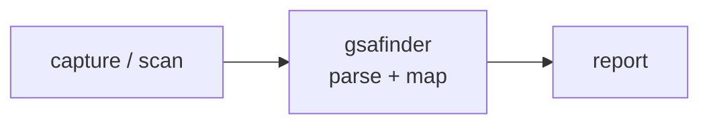

<a name="top"></a>
<div align="center">


# GSAFINDER

### GSA Schedule opportunity surveyor — SAM.gov + eBuy + FedConnect


[](https://pypi.org/project/cognis-gsafinder/) [](https://github.com/cognis-digital/gsafinder/actions) [](LICENSE) [](https://github.com/cognis-digital)

*Federal / Compliance — NIST, CMMC, FedRAMP, and SBIR/GSA workflows.*

</div>

```bash
pip install cognis-gsafinder
gsafinder survey opportunities.json -p profile.json   # → ranked bids in seconds
```


<!-- cognis:example:start -->

## Watch the walkthrough

A full narrated tour — setup, the tool in action, and every demo scenario:

[](https://github.com/cognis-digital/gsafinder/releases/download/walkthrough-v1/walkthrough.mp4)

▶ **[Watch the walkthrough (MP4)](https://github.com/cognis-digital/gsafinder/releases/download/walkthrough-v1/walkthrough.mp4)**

## 🔎 Example output

Real, reproducible output from the tool — runs offline:

```console
$ gsafinder-emit --version
gsafinder 0.5.2
```

```console
$ gsafinder-emit --help
usage: gsafinder [-h] [--version] {survey} ...

GSA Schedule opportunity surveyor (SAM.gov / eBuy / FedConnect).

positional arguments:
  {survey}
    survey    score and rank opportunities against a vendor profile

options:
  -h, --help  show this help message and exit
  --version   show program's version number and exit
```

> Blocks above are real `gsafinder` output — reproduce them from a clone.

**Sample result format** _(illustrative values — run on your own data for real findings):_

```
{
"findings": [
    {
        "id": "1234567890",
        "title": "Suspicious Network Traffic",
        "description": "Potential malicious activity detected on port 443",
        "created_by": "John Doe",
        "created_at": "2023-02-20T14:30:00Z"
    },
    {
        "id": "2345678901",
        "title": "Unusual File Access",
        "description": "Unauthorized access to a sensitive file",
        "created_by": "Jane Smith",
        "created_at": "2023-02-21T10:45:00Z"
    }
]
}
```

<!-- cognis:example:end -->

## Usage — step by step

1. Install (Python 3.9+):
   ```bash
   pip install gsafinder
   ```
2. Prepare two JSON inputs: an opportunities file (e.g. exported from
   SAM.gov / eBuy / FedConnect) and a vendor `profile.json`. Score and rank
   them:
   ```bash
   gsafinder survey opportunities.json --profile profile.json
   ```
3. Filter to bids worth chasing — only eligible notices, a minimum score, and
   the top N:
   ```bash
   gsafinder survey opportunities.json -p profile.json --eligible-only \
       --min-score 50 --top 20
   ```
4. Read the output: the table ranks rows by `SCORE` with `ELIG`, `DAYS` left,
   `NOTICE_ID`, set-aside and title. For automation, use `--format json` and
   read the `results[]` array (each with `score`, `eligible`, `days_left`).
5. Export for a capture-team spreadsheet with `--format csv`:
   ```bash
   gsafinder survey opportunities.json -p profile.json --eligible-only \
       --min-score 40 --format csv > pipeline.csv
   ```
   Columns: `score, eligible, days_left, notice_id, agency, source, naics,
   set_aside, sins, response_due, title, reasons` (list fields pipe-joined so
   each value stays in one cell).
6. Pipe into other tooling / a daily watch:
   ```bash
   gsafinder survey opportunities.json -p profile.json --eligible-only \
       --format json | jq '.results[] | select(.days_left <= 7)'
   ```

## Contents

- [Why gsafinder?](#why) · [Features](#features) · [Quick start](#quick-start) · [Example](#example) · [Demos](#demos) · [Architecture](#architecture) · [AI stack](#ai-stack) · [How it compares](#how-it-compares) · [Integrations](#integrations) · [Install anywhere](#install-anywhere) · [Related](#related) · [Contributing](#contributing)

<a name="why"></a>
## Why gsafinder?

GSA Schedule opportunity surveyor — SAM.gov + eBuy + FedConnect — without standing up heavyweight infrastructure.

`gsafinder` is single-purpose, scriptable, and self-hostable: point it at a target, get prioritized results in the format your workflow already speaks (table · JSON · SARIF), gate CI on it, and let agents drive it over MCP.

<div align="right"><a href="#top">↑ back to top</a></div>

<a name="features"></a>
## Features

- ✅ Set-aside eligibility gate (SDVOSB / WOSB / EDWOSB / 8(a) / HUBZone / Total SB ladder)
- ✅ NAICS + GSA Schedule SIN matching
- ✅ Whole-word keyword relevance (no "AI" inside "maintain" false positives)
- ✅ Deadline urgency bonus + closed-notice penalty
- ✅ Output as table, JSON, **or CSV** for spreadsheets/BI
- ✅ `--eligible-only`, `--min-score`, `--top N` filters for focused bid lists
- ✅ Nine runnable real-format demos in [`demos/`](demos/)
- ✅ Runs on Linux/macOS/Windows · Docker · devcontainer
- ✅ Ports in Python, JavaScript, Go, and Rust (`ports/`)

<div align="right"><a href="#top">↑ back to top</a></div>

<a name="quick-start"></a>
## Quick start

```bash
pip install cognis-gsafinder
gsafinder --version
gsafinder survey opportunities.json -p profile.json                 # ranked table
gsafinder survey opportunities.json -p profile.json --format json   # machine-readable
gsafinder survey opportunities.json -p profile.json --format csv    # spreadsheet
gsafinder survey opportunities.json -p profile.json \
    --eligible-only --min-score 50 --top 20                         # focused bid list
```

<div align="right"><a href="#top">↑ back to top</a></div>

<a name="example"></a>
## Example

```text
$ gsafinder survey demos/01-basic/opportunities.json -p demos/01-basic/profile.json
SCORE  ELIG  DAYS  NOTICE_ID              SET-ASIDE  TITLE
-----  ----  ----  ---------------------  ---------  ---------------------------------------
60.5   yes   9     W912-26-R-3301         NONE       Enterprise Cybersecurity Operations Support
57.5   yes   -8    GS-35F-26-CLOUD-0042   SDVOSB     Zero Trust Cloud Migration and Managed Hosting
15.0   yes   19    GSA-26-JAN-7777        TOTAL_SB   Custodial and Janitorial Services
0.0    no    4     HHS-26-8A-0099         8A         Data Center Cloud Modernization (INELIGIBLE)
```

<div align="right"><a href="#top">↑ back to top</a></div>

<a name="demos"></a>
## Demos

**Narrated, audience-targeted Python scenarios.** Five runnable scenarios drive
the real `gsafinder` API against the bundled fixtures (offline — no SAM.gov /
eBuy calls), print narrated output, and exit 0. See [`docs/DEMOS.md`](docs/DEMOS.md).

```bash
PYTHONUTF8=1 python demos/run_all.py            # all five, end to end
PYTHONUTF8=1 python demos/03_bd_pipeline_export.py   # or just one
```

| Scenario | Audience | What it shows |
|---|---|---|
| [`01_capture_manager_triage`](demos/01_capture_manager_triage.py) | GovCon capture managers | Rank the morning's pull, surface the top lead's rationale, flag the no-bids |
| [`02_small_biz_eligibility`](demos/02_small_biz_eligibility.py) | Small-biz federal sellers | The set-aside ladder across three vendors — where EDWOSB/8(a)/HUBZone certs open or close the door |
| [`03_bd_pipeline_export`](demos/03_bd_pipeline_export.py) | BD teams | A 5-agency cyber batch filtered to eligible high-score leads, rendered as the real `to_csv` export |
| [`04_proposal_deadline_watch`](demos/04_proposal_deadline_watch.py) | Proposal teams | Sort the day's work into respond-now / on-the-radar / too-late from the urgency + closed-notice scoring |
| [`05_keyword_precision`](demos/05_keyword_precision.py) | Capture analysts | Whole-word matching — "AI"/"ML" hit real notices but never the "maintain" noise |

**Real-format fixture demos.** Nine fixture directories under [`demos/`](demos/)
— each has a `SCENARIO.md`, an `opportunities.json`, and a `profile.json` in the
tool's real input format. Run any of them straight from a clone (`python -m
gsafinder survey demos/<name>/opportunities.json -p demos/<name>/profile.json`):

| Demo | What it shows |
|---|---|
| [`01-basic`](demos/01-basic) | First survey: NAICS/SIN/keyword scoring, eligibility gate, closed notice |
| [`04-full-and-open-it`](demos/04-full-and-open-it) | Vendor with **no certs** — set-aside notices flagged ineligible |
| [`05-wosb-staffing`](demos/05-wosb-staffing) | **EDWOSB** ladder — covers WOSB/Total SB, not SDVOSB |
| [`06-8a-graduate`](demos/06-8a-graduate) | **8(a)** analytics firm — HUBZone notice is the gap |
| [`07-hubzone-construction`](demos/07-hubzone-construction) | **HUBZone** trades vendor with **no SINs** (NAICS+keyword only) |
| [`08-csv-pipeline`](demos/08-csv-pipeline) | `--format csv` export for a capture-team spreadsheet |
| [`09-multi-agency-cyber`](demos/09-multi-agency-cyber) | Larger batch across 5 agencies, `--top` triage |
| [`10-keyword-noise`](demos/10-keyword-noise) | Whole-word matching: "AI"/"ML" don't match "maintain" |
| [`11-deadline-triage`](demos/11-deadline-triage) | Urgency bonus + closed-notice penalty for daily watch |

<div align="right"><a href="#top">↑ back to top</a></div>

<a name="architecture"></a>
## Architecture



<div align="right"><a href="#top">↑ back to top</a></div>

<a name="ai-stack"></a>
## Use it from any AI stack

`gsafinder` is interoperable with every popular way of using AI:

- **MCP server** — `gsafinder mcp` (Claude Desktop, Cursor, Cognis.Studio, [uncensored-fleet](https://github.com/cognis-digital/uncensored-fleet))
- **OpenAI-compatible / JSON** — pipe `gsafinder survey opportunities.json -p profile.json --format json` into any agent or LLM
- **LangChain · CrewAI · AutoGen · LlamaIndex** — wrap the CLI/JSON as a tool in one line
- **CI / scripts** — exit codes + SARIF for non-AI pipelines

<div align="right"><a href="#top">↑ back to top</a></div>

<a name="how-it-compares"></a>
## How it compares

| | **Cognis gsafinder** | typical tools |
|---|:---:|:---:|
| Self-hostable, no account | ✅ | varies |
| Single command, zero config | ✅ | ⚠️ |
| JSON + SARIF for CI | ✅ | varies |
| MCP-native (AI agents) | ✅ | ❌ |
| Polyglot ports (JS/Go/Rust) | ✅ | ❌ |
| Open license | ✅ COCL | varies |
<div align="right"><a href="#top">↑ back to top</a></div>

<a name="integrations"></a>
## Integrations

Pipes into your stack: **SARIF** for code-scanning, **JSON** for anything, an **MCP server** (`gsafinder mcp`) for AI agents, and a webhook forwarder for SIEM/Slack/Jira. See [`docs/INTEGRATIONS.md`](docs/INTEGRATIONS.md).

<div align="right"><a href="#top">↑ back to top</a></div>

<a name="install-anywhere"></a>
## Install — every way, every platform

```bash
pip install "git+https://github.com/cognis-digital/gsafinder.git"    # pip (works today)
pipx install "git+https://github.com/cognis-digital/gsafinder.git"   # isolated CLI
uv tool install "git+https://github.com/cognis-digital/gsafinder.git" # uv
pip install cognis-gsafinder                                          # PyPI (when published)
docker run --rm ghcr.io/cognis-digital/gsafinder:latest --help        # Docker
brew install cognis-digital/tap/gsafinder                             # Homebrew tap
curl -fsSL https://raw.githubusercontent.com/cognis-digital/gsafinder/main/install.sh | sh
```

| Linux | macOS | Windows | Docker | Cloud |
|---|---|---|---|---|
| `scripts/setup-linux.sh` | `scripts/setup-macos.sh` | `scripts/setup-windows.ps1` | `docker run ghcr.io/cognis-digital/gsafinder` | [DEPLOY.md](docs/DEPLOY.md) (AWS/Azure/GCP/k8s) |

<div align="right"><a href="#top">↑ back to top</a></div>

<a name="related"></a>
## Related Cognis tools

- [`checkpoint-ai`](https://github.com/cognis-digital/checkpoint-ai) — NIST AI RMF / EU AI Act / ISO 42001 self-assessment & SSP generator
- [`cmmcmap`](https://github.com/cognis-digital/cmmcmap) — CMMC Level 2 practice mapper — stack-aware SSP skeleton generator
- [`fedramplens`](https://github.com/cognis-digital/fedramplens) — FedRAMP boundary visualizer & OSCAL-format SSP/POAM generator
- [`sbirscout`](https://github.com/cognis-digital/sbirscout) — SBIR/STTR topic discovery — DSIP + SBIR.gov + NIH digest with bid scoring
- [`clearancepath`](https://github.com/cognis-digital/clearancepath) — Personnel clearance hygiene tracker — SF-86, SEAD-3/4, training currency

**Explore the suite →** [🗂️ all 170+ tools](https://github.com/cognis-digital/cognis-neural-suite) · [⭐ awesome-cognis](https://github.com/cognis-digital/awesome-cognis) · [🔗 cognis-sources](https://github.com/cognis-digital/cognis-sources) · [🤖 uncensored-fleet](https://github.com/cognis-digital/uncensored-fleet) · [🧠 engram](https://github.com/cognis-digital/engram)

<div align="right"><a href="#top">↑ back to top</a></div>

<a name="contributing"></a>
## Contributing

PRs, new rules, and demo scenarios are welcome under the collaboration-pull model — see [CONTRIBUTING.md](CONTRIBUTING.md) and [SECURITY.md](SECURITY.md).

> ### ⭐ If `gsafinder` saved you time, **star it** — it genuinely helps others find it.

## Interoperability

`{}` composes with the 300+ tool Cognis suite — JSON in/out and a shared
OpenAI-compatible `/v1` backbone. See **[INTEROP.md](INTEROP.md)** for the
suite map, composition patterns, and reference stacks.

## License

Source-available under the **Cognis Open Collaboration License (COCL) v1.0** — free for personal, internal-evaluation, research, and educational use; **commercial / production use requires a license** (licensing@cognis.digital). See [LICENSE](LICENSE).

---

<div align="center"><sub><b><a href="https://cognis.digital">Cognis Digital</a></b> · one of 170+ tools in the <a href="https://github.com/cognis-digital/cognis-neural-suite">Cognis Neural Suite</a> · <i>Making Tomorrow Better Today</i></sub></div>
