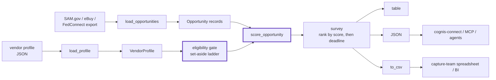
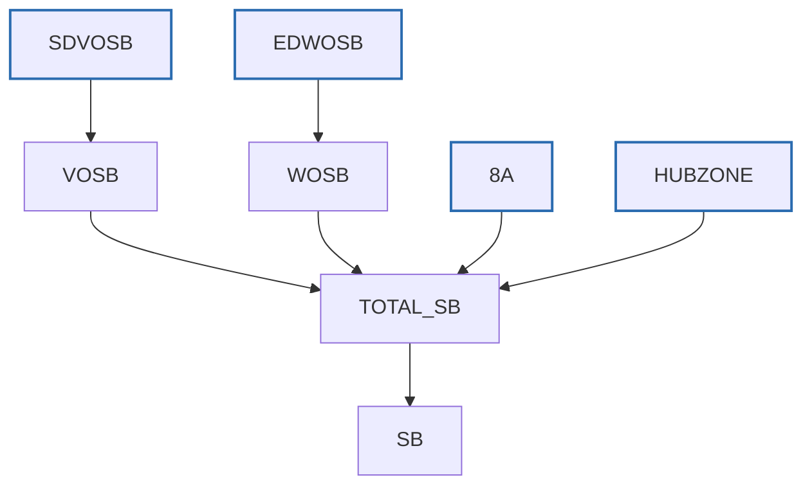

# Architecture

`gsafinder` is a single-purpose GSA Schedule opportunity surveyor. It takes a
batch of normalized federal opportunity records (exported from SAM.gov, eBuy, or
FedConnect) plus a vendor profile, applies a set-aside **eligibility gate**, and
**scores and ranks** what's left so a capture team knows what to chase first. No
network, no daemon, no data leaves your machine — the same JSON in, ranked
table / JSON / CSV out.

## The pipeline

## Components

### Loaders (`gsafinder.core.load_opportunities`, `load_profile`)
Read JSON from disk and build typed records. `load_opportunities` accepts either
a bare list or a `{"opportunities": [...]}` / `{"results": [...]}` envelope —
the shape SAM.gov / eBuy / FedConnect exports normalize to. Each record is
validated (`notice_id` and `title` are required) on the way in.

### Data model (`Opportunity`, `VendorProfile`, `ScoredOpportunity`)
Plain dataclasses. An `Opportunity` carries the notice id, title, agency, NAICS
code, set-aside type, referenced GSA Schedule SINs, response-due date, and
source. A `VendorProfile` carries the vendor's NAICS codes, SINs, held
set-aside certifications, and capability keywords.

### Eligibility gate (`VendorProfile.eligible_set_asides`)
The first thing applied, and a hard gate: if the vendor does not hold the
notice's set-aside, the notice scores **0** and is marked ineligible. The ladder
encodes the real socioeconomic implications — an SDVOSB also satisfies VOSB and
Total SB; an EDWOSB satisfies WOSB and Total SB; an 8(a) does **not** satisfy
HUBZone. Open / full-and-open notices are biddable by anyone.

### Scorer (`score_opportunity`)
For an eligible notice, points accrue: NAICS exact match `+35`, GSA SIN overlap
`+25` (capped), set-aside eligibility `+15`, whole-word keyword relevance up to
`+25`, and a deadline term — `+10` urgency bonus if due within 7 days, `+5`
within 14, and a `-30` penalty for an already-closed notice. Keyword matching is
**whole-word** (regex word boundaries) so "AI" never matches "maintain". Every
notice comes back with a `reasons[]` list explaining its score.

### Ranker (`survey`)
Scores a whole batch, applies optional `min_score` and `eligible_only` filters,
and sorts by score descending, breaking ties toward the nearer deadline. This is
exactly what the CLI's `survey` subcommand calls.

### Output (`to_csv`, CLI table / JSON)
`to_csv` renders a stable 12-column export (`score, eligible, days_left,
notice_id, agency, source, naics, set_aside, sins, response_due, title,
reasons`) with list fields pipe-joined so each value stays in one spreadsheet
cell. The CLI also emits a narrated table and machine-readable JSON.

### Interop (`gsafinder.connect`, `mcp_server`)
The JSON output maps to the canonical `Finding` contract and forwards via
`cognis-connect` (STIX/MISP/Sigma/Splunk/Elastic/Slack/webhook). An MCP server
exposes the surveyor to AI agents.

## Why these choices

- **Eligibility first.** A notice you can't legally bid is worth zero, not "a
  little" — the gate runs before any scoring so no-bids never clutter the list.
- **Explainable scores.** Every result carries its `reasons[]`, so a capture
  decision has a written rationale, not a black-box number.
- **Offline and scriptable.** JSON in, table / JSON / CSV out. No account, no
  network call to SAM.gov at survey time — you point it at an export you already
  pulled.
